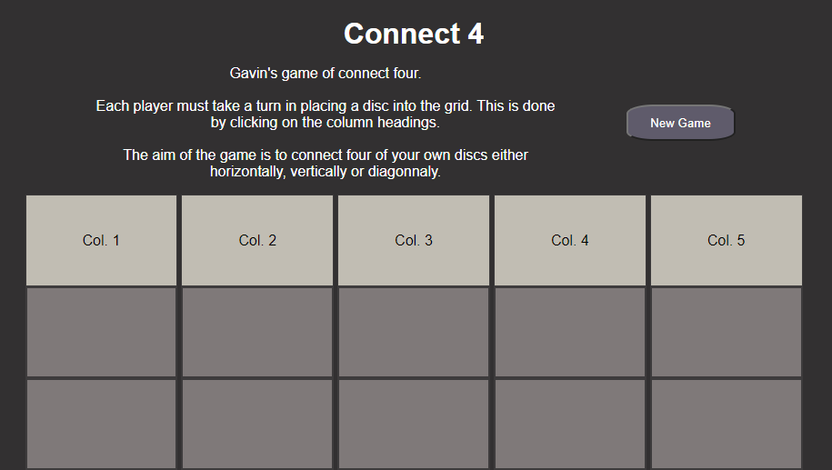

# Connect Four JavaScript Game

Here is my version of Connect 4 which I built as part of the _Nology course.

The game can be found on GH Pages here: https://gavinstirling.github.io/connect-four/.

A preview of the game can be seen below:

The goal for this project is to demonstrate my understanding and competence when working with HTML, SCSS and Javascript.

The brief was to develop a working game and have the game be able to reset without refreshing the page.

It makes use of a nested array to track two players who drop discs into columns with the aim to connect four in a row of the same colour.
